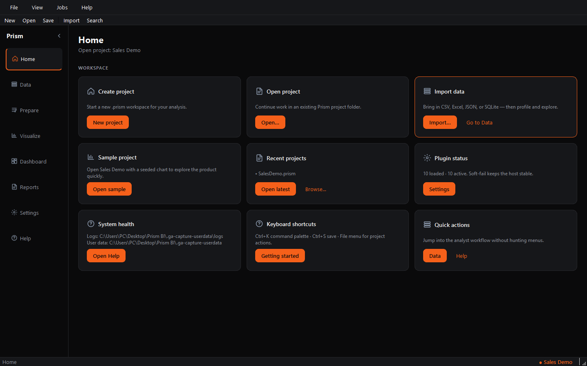
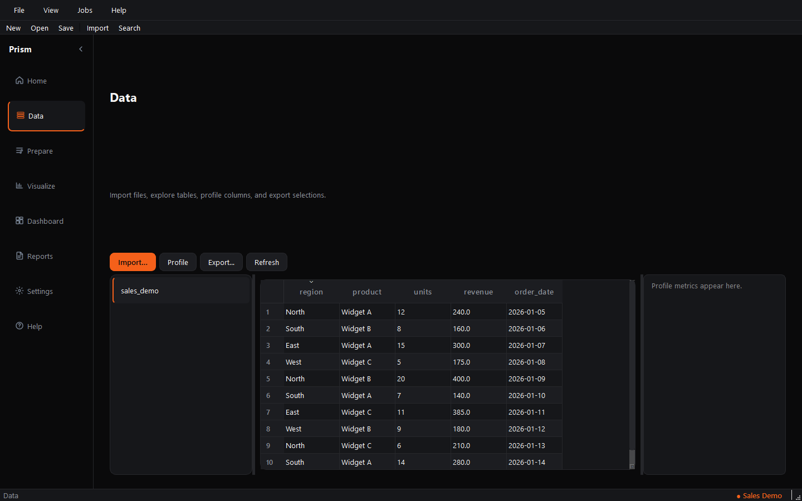
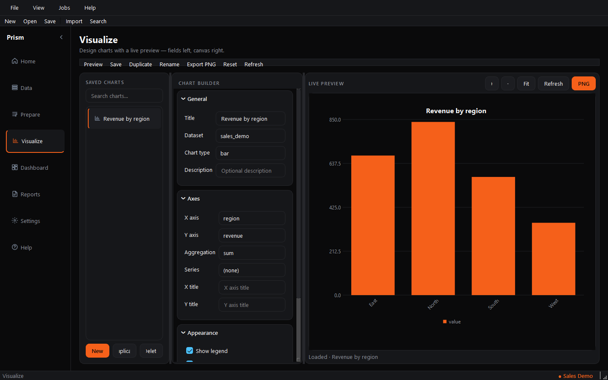

# Prism BI

Commercial desktop Business Intelligence for analysts and managers.

Prism BI lets you import heterogeneous files, profile and clean data, explore large
tables, build charts and dashboards, and export CSV, Excel, JSON, PNG, and PDF —
without hardcoding schemas, table names, or column layouts.



**Version:** 1.0.0 (General Availability)  
**Platform:** Windows 10/11 · Python 3.11+  
**License:** Proprietary — see [LICENSE](LICENSE)

---

## Highlights

- **Schema-agnostic** import for CSV, Excel, JSON, and SQLite
- **DuckDB** warehouse per `.prism` project with revisioned datasets
- **Prepare** cleaning pipeline (SQL-compiled, transparent steps)
- **Visualize & Dashboard** via replaceable chart plugins (QtCharts)
- **Reports & Export** via replaceable exporter plugins (CSV / XLSX / JSON / PNG / PDF)
- **Plugin SDK** (`prism_bi_sdk`) — connectors, charts, and exporters ship without core edits
- **Soft-fail plugins** — a bad plugin cannot take down the host

| Home | Data | Visualize |
|------|------|-----------|
|  |  |  |

Additional captures: [Prepare](docs/screenshots/prepare.png) · [Dashboard](docs/screenshots/dashboard.png) · [Reports](docs/screenshots/reports.png)

---

## Quick start (developers)

```powershell
uv sync --extra dev
uv run prism-bi
```

Open the sample: **File → Open Project…** → `samples/SalesDemo.prism`.

Headless smoke (no UI):

```powershell
uv run prism-bi --headless
```

### Quality gate

```powershell
$env:QT_QPA_PLATFORM = "offscreen"
just check
# or:
uv run ruff check src tests plugins
uv run ruff format --check src tests plugins
uv run mypy
uv run lint-imports --config importlinter_contracts.ini
uv run pytest
```

---

## First run

1. Launch `prism-bi` (or the installed Start Menu shortcut).
2. **File → Open Project…** and select `samples/SalesDemo.prism`, **or**
   **File → New Project** and choose a folder — Prism creates a `*.prism` workspace
   (`project.json`, `warehouse.duckdb`, `artifacts/`).
3. Open **Data → Import…** and select a CSV / Excel / JSON / SQLite file.
4. Use **Prepare**, **Visualize**, **Dashboard**, and **Reports** as needed.
5. Press **Ctrl+K** to jump to datasets, columns, dashboards, and commands.
6. **Help → Getting Started** for a short in-app walkthrough.

User data (settings, logs, recent projects, optional plugins) lives under:

`%USERPROFILE%\.prism-bi\`

Logs rotate under `.prism-bi\logs\prism-bi.log`. Corrupt `settings.toml` is recovered
(backed up to `.toml.bak`) so the application still starts with packaged defaults.

---

## Architecture (summary)

| Layer / package | Role |
|-----------------|------|
| `prism_bi_sdk` | Stable public plugin contracts & DTOs |
| `prism_bi.domain` | Entities, cleaning, profiling (no Qt / DuckDB) |
| `prism_bi.application` | Use cases, ports, jobs, viz/export registries |
| `prism_bi.infrastructure` | DuckDB, project store, config, logging, plugin host |
| `prism_bi.presentation` | PySide6 shell and module views |
| `plugins/` | First-party datasources, charts, exporters |

Architecture decisions: [docs/architecture/](docs/architecture/).

Project layout: [docs/PROJECT_STRUCTURE.md](docs/PROJECT_STRUCTURE.md).

---

## Packaging (Windows)

See [packaging/windows/README.md](packaging/windows/README.md) for building a
portable folder with PyInstaller and an optional Inno Setup installer.

```powershell
# Portable build (+ zip)
.\scripts\build_windows.ps1
# Run:  .\dist\PrismBI\PrismBI.exe
# Share: dist\PrismBI-portable-1.0.0.zip  (whole folder — not the .exe alone)
```

---

## Documentation

| Document | Purpose |
|----------|---------|
| [CHANGELOG.md](CHANGELOG.md) | Version history |
| [docs/RELEASE_NOTES_v1.0.0.md](docs/RELEASE_NOTES_v1.0.0.md) | GA release notes |
| [docs/RELEASE_CHECKLIST_v1.0.0.md](docs/RELEASE_CHECKLIST_v1.0.0.md) | Release cut checklist |
| [docs/PRODUCTION_READINESS_REPORT_v1.0.0.md](docs/PRODUCTION_READINESS_REPORT_v1.0.0.md) | Production readiness report |
| [docs/FINAL_CONSISTENCY_REPORT.md](docs/FINAL_CONSISTENCY_REPORT.md) | Post-release consistency audit |
| [docs/KNOWN_ISSUES.md](docs/KNOWN_ISSUES.md) | Known limitations |
| [docs/THIRD_PARTY_NOTICES.md](docs/THIRD_PARTY_NOTICES.md) | Third-party licenses |
| [docs/plugin-sdk/README.md](docs/plugin-sdk/README.md) | Plugin author guide |
| [samples/README.md](samples/README.md) | Sample project |
| [benchmarks/README.md](benchmarks/README.md) | NFR benchmark harness |

---

## License

Proprietary. Copyright © 2026 Prism BI. All rights reserved.  
See [LICENSE](LICENSE) and [docs/THIRD_PARTY_NOTICES.md](docs/THIRD_PARTY_NOTICES.md).
